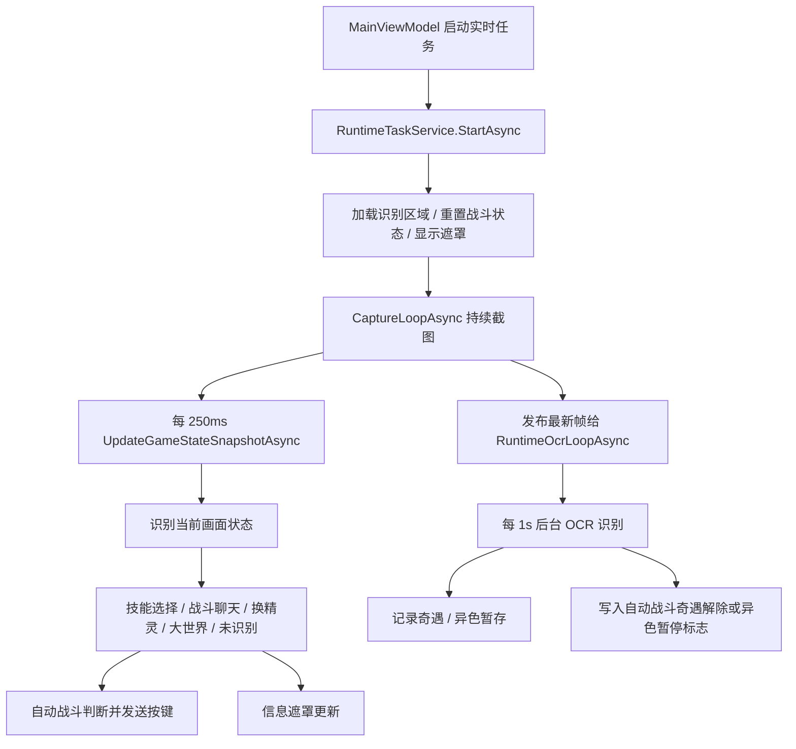

# 自动战斗逻辑梳理

本文档记录当前自动战斗的真实代码路径，目标是为后续重构提供边界、状态、规则和风险点。

## 关键文件

- `RocoPilot/Models/Runtime/AutoBattleSettings.cs`：自动战斗配置模型。
- `RocoPilot/ViewModels/RealtimeViewModel.cs`：实时页自动战斗开关、奇遇解除策略、配置摘要和设置保存。
- `RocoPilot/Views/Windows/AutoBattleConfigWindow.xaml.cs`：释放顺序和自定义按键序列编辑器。
- `RocoPilot/Services/RuntimeTaskService.cs`：实时任务生命周期、截图循环、游戏状态识别调度。
- `RocoPilot/Services/RuntimeTasks/RuntimeTaskService.AutoBattle.cs`：自动战斗状态、按键决策和执行。
- `RocoPilot/Services/RuntimeTasks/RuntimeTaskService.EncounterStatistics.cs`：奇遇统计与异色识别；当前会反向影响自动战斗状态。
- `RocoPilot/Configuration/RecognitionRegions/2048x1152.json`：识别区域坐标。
- `RocoPilot/Configuration/EncounterSeasons/seasons.json`：当前赛季奇遇解除提示文本。

## 总体链路

自动战斗按键没有独立循环。它挂在实时截图循环中，由 `UpdateGameStateSnapshotAsync` 判断当前画面后顺手触发。OCR 类任务独立运行在 `RuntimeOcrLoopAsync` 中，按固定频率消费主截图循环发布的最新帧，避免 OCR 阻塞状态识别和按键发送。

## 启动与配置流

1. 实时页修改自动战斗开关、奇遇解除策略或释放配置时，`RealtimeViewModel` 调用 `IRuntimeTaskService.SetAutoBattleSettings` 保存设置。
2. 主页面启动实时任务时，`MainViewModel` 将 `_runtimeTaskService.AutoBattleSettings` 放进 `RuntimeTaskStartOptions`。
3. `RuntimeTaskService.StartAsync` 会重新规范化设置、重置自动战斗运行态，并启动截图循环。
4. 配置窗口保存时，会把释放顺序写入 `ReleaseSequence`，同时把旧字段 `TurnSequence` 设回默认值 `{skill}`。

`RoundOrder` 和 `TurnSequence` 现在更像兼容旧配置的字段；新配置主要靠 `ReleaseSequence` 表达。

## 当前画面状态识别顺序

`UpdateGameStateSnapshotAsync` 现在按“大状态门禁 + 战斗子状态”的方式处理。

大状态门禁：

1. 如果当前不在战斗中，只允许 `battle-chat` 作为进入战斗的标志。
2. 如果当前已经在战斗中，只允许大世界 `magic-point` 识别成功作为退出战斗的标志。
3. 进入战斗后，即使捕捉动画、技能动画或其他中间画面识别不到战斗 UI，也继续保持战斗状态。
4. 不在战斗且没有识别到 `battle-chat` 时，才按大世界魔力点或未识别处理。

战斗子状态：

1. 优先判断技能选择界面：在 `battle-button-skill` 区域匹配 `battle-button-skill.png`。
2. 如果不是技能选择，再判断换精灵界面：在 `battle-button-change` 区域匹配 `battle-button-change.png`。
3. 如果不是上述两个子状态，再判断 `battle-chat`，用于普通战斗态和奇遇/异色提示扫描。
4. 如果战斗中这些子状态都未识别到，仍保持“战斗中”，并结束当前技能选择态。

这些状态识别和自动战斗按键动作仍在同一个方法里，OCR 识别已经拆到独立循环。

## 自动战斗运行态

当前自动战斗的状态不是一个显式状态机，而是一组私有字段组合：

- `_autoBattleRoundIndex`：当前释放顺序索引。
- `_autoBattleTurnNumber`：本场战斗累计回合号。
- `_currentAutoBattleTurnNumber`：当前正在处理的回合号，主要用于日志。
- `_wasAutoBattleSkillSelectionVisible`：本轮技能选择界面是否已经进入过，用于避免重复开新回合。
- `_autoBattleSkillSelectionVisibleSince`：技能选择界面首次出现时间。
- `_lastAutoBattleSkillSelectionActionAt`：上次自动按键时间，用于 4 秒重试。
- `_currentAutoBattleReleaseStep`：进入当前回合时冻结的释放步骤。
- `_autoBattleSkillSelectionAction`：当前回合已经执行过的动作，影响轮转和技能释放失败处理。
- `_isAutoBattleEncounterRelieved`：是否已识别奇遇效果解除。
- `_isAutoBattleSuspendedForShiny`：是否因异色提示暂停本场自动战斗。
- `_wasAutoBattlePetSwitchingVisible`：换精灵界面是否已处理过，避免重复换精灵。

重构时建议把这些字段收敛到一个 `AutoBattleRunState` 或 `BattleSessionState` 中，并用枚举表达战斗阶段。

## 战斗序列和覆盖规则

用户配置的释放顺序是自动战斗的基础序列。默认情况下，每个可释放技能的回合执行一个步骤，执行成功后推进到下一个步骤，走到末尾后循环。

特殊情况按优先级覆盖：

1. 异色保护优先级最高；识别到异色后，本场战斗停止所有自动按键，直到退出战斗后重置。
2. 奇遇解除后，如果配置为 `NoAction`、`RecoverEnergy` 或 `Capture`，会覆盖原本的释放顺序，直到战斗结束。
3. 奇遇解除后如果配置为 `ReleaseSkill`，等同于没有奇遇解除覆盖，继续按原释放顺序执行技能。
4. 技能释放失败是普通技能释放后的补救逻辑；按键后 `500ms` 仍停留在技能选择界面时，本回合改为 `X` 回能，原本应释放的技能延后到下一个可释放技能的回合。
5. 被动切换精灵本身算一个回合，但不能释放技能，原本应释放的技能同样延后到下一个可释放技能的回合。

因此，释放顺序只在“普通技能或自定义释放序列实际执行”后推进。回能、捕捉、无操作、切换精灵都不会推进释放顺序。

## 技能选择处理

技能选择界面出现时，处理流程如下：

1. 第一次识别到技能选择界面，只创建新回合状态，不立即按键。
2. 等待 `500ms`，避免 UI 刚出现时按键丢失。
3. 选取当前释放步骤：
   - 普通技能步骤：把技能键套进 `TurnSequence`，默认就是 `{skill}`。
   - 自定义步骤：直接使用配置中的完整按键序列。
4. 如果已识别奇遇解除，且策略需要特殊处理，则覆盖普通释放：
   - `NoAction`：不按键，等待手动操作。
   - `RecoverEnergy`：按 `X` 回能。
   - `Capture`：按 `W, 1, Space` 捕捉。
   - `ReleaseSkill`：不等待奇遇解除，始终走普通释放顺序。
5. 发送按键后记录本回合动作。
6. 如果按键后 `500ms` 仍停留在技能选择界面，会按 `X` 回能，并把当前帧交给后台任务做一次 `battle-tip` OCR 记录失败原因。
7. 如果补救后 4 秒仍停留在技能选择界面，会重试当前动作。

释放顺序索引只在当前回合动作是 `Skill` 时递增。回能、捕捉、无操作不会推进释放顺序。

## 技能释放失败处理

技能释放失败是一个反应式补救逻辑，不再强制匹配固定提示内容：

1. 只有当前回合已经发送过 `Skill` 动作后，才会进入失败检查。
2. 如果按键后 `500ms` 仍处于“战斗中 - 技能选择”，判定本次技能没有释放成功。
3. 将当前帧交给后台任务做一次 `battle-tip` OCR，用于记录失败提示；该 OCR 不阻塞回能按键和主状态循环。
4. 立即发送 `X` 回能。
5. 当前回合动作改成 `EnergyRecovery`。
6. 因为最终动作不是 `Skill`，所以释放顺序不推进，原技能延后到下一个可释放技能的回合。

这意味着系统先尝试释放技能，再通过是否离开技能选择界面判断成败；失败判定不依赖 OCR，OCR 只用于补充日志。

## 奇遇解除处理

奇遇解除有两条入口：

1. 自动战斗路径：`RuntimeOcrLoopAsync` 每 1 秒按当前赛季 `detectionMode` 检测奇遇解除。S1 使用 `battle-tip` 与 `tipText` 做相似度匹配；S2 优先使用 `battle-enemy-name` 的“幸运惊喜盒 -> 真实精灵名”变化，未命中时继续用 `tipText` 识别 S2 中低概率刷出的污染解除。
2. 奇遇统计路径：后台 OCR 统计识别时，也会按当前赛季 `detectionMode` 检测；匹配成功后会调用自动战斗的 `ApplyAutoBattleEncounterRelievedDetection`。

这形成了当前较隐蔽的耦合：奇遇统计模块会直接改自动战斗状态。重构时建议改为事件，例如 `EncounterRelievedDetected`，由自动战斗控制器消费。

奇遇解除后的动作策略：

- `NoAction`：不再按键，等待用户手动操作。
- `RecoverEnergy`：每次进入技能选择都按 `X` 回能。
- `ReleaseSkill`：忽略奇遇解除覆盖，继续按原释放顺序战斗。
- `Capture`：每次进入技能选择都执行 `W, 1, Space` 捕捉。

这些覆盖动作持续到战斗结束；退出战斗后自动战斗状态会重置。

## 异色保护处理

后台 OCR 会在战斗态中识别 `battle-tip-heterochromia` 区域：

1. 匹配 `发现异色精灵` 或包含 `异色`、`精灵` 的提示。
2. 设置 `_isAutoBattleSuspendedForShiny = true`。
3. 重置当前技能选择态。
4. 本场战斗内停止所有自动按键。
5. 退出战斗并重置自动战斗状态后恢复。

奇遇统计中的异色识别也会调用同一个暂停入口。

## 换精灵处理

换精灵界面识别到后：

1. 先结束当前技能选择态。
2. 切换精灵本身记为一个独立回合，因为本回合无法释放技能。
3. 切换精灵回合只增加回合号，不推进释放顺序；如果原本轮到技能 `4`，切换后下一次技能选择仍然继续释放 `4`。
4. 如果没有异色暂停，尝试自动换精灵。
5. 从 1 到 6 依次按槽位数字。
6. 每次按槽位后等待 `1500ms`，再按 `Space` 确认。
7. 再等待 `1500ms`，重新截图判断是否仍在换精灵界面。
8. 如果已经离开换精灵界面，则认为切换成功。

这里的策略是硬编码的，后续如果需要选择优先级、跳过阵亡位、只切某几只，应该抽成独立 `PetSwitchStrategy`。

